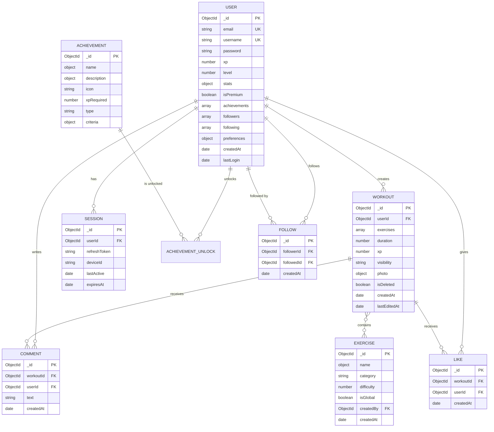

# Data Model - RIZE

> **Modelo de datos completo**: Este documento define todos los schemas de MongoDB con Mongoose, relaciones entre entidades, índices, validaciones y diagramas visuales.

## 📋 Tabla de Contenidos

- [Diagrama General](#diagrama-general)
- [User](#user)
- [Workout](#workout)
- [Exercise](#exercise)
- [Achievement](#achievement)
- [Session](#session)
- [Comment](#comment)
- [Like](#like)
- [Follow](#follow)
- [Índices](#índices)

---

## 🗺️ Diagrama General



---

## 👤 User

### Schema

```typescript
import { Schema, model, Document } from 'mongoose';
import bcrypt from 'bcrypt';

export interface IUser extends Document {
  email: string;
  username: string;
  password: string;
  avatar?: {
    url: string;
    publicId: string;
  };
  bio?: string;
  xp: number;
  level: number;
  stats: {
    totalWorkouts: number;
    totalXP: number;
    currentStreak: number;
    longestStreak: number;
  };
  isPremium: boolean;
  premiumExpiresAt?: Date;
  achievements: Schema.Types.ObjectId[];
  followers: Schema.Types.ObjectId[];
  following: Schema.Types.ObjectId[];
  preferences: {
    units: 'metric' | 'imperial';
    language: 'es' | 'en';
    theme: 'light' | 'dark' | 'auto';
    notifications: {
      followers: boolean;
      comments: boolean;
      achievements: boolean;
    };
  };
  lastLogin?: Date;
  createdAt: Date;
  
  // Methods
  comparePassword(candidatePassword: string): Promise<boolean>;
  calculateLevel(): number;
}

const userSchema = new Schema<IUser>({
  email: {
    type: String,
    required: true,
    unique: true,
    lowercase: true,
    trim: true,
    match: /^[^\s@]+@[^\s@]+\.[^\s@]+$/
  },
  username: {
    type: String,
    required: true,
    unique: true,
    lowercase: true,
    trim: true,
    minlength: 3,
    maxlength: 20,
    match: /^[a-z0-9_]+$/
  },
  password: {
    type: String,
    required: true,
    minlength: 8,
    select: false // No incluir en queries por defecto
  },
  avatar: {
    url: String,
    publicId: String
  },
  bio: {
    type: String,
    maxlength: 160
  },
  xp: {
    type: Number,
    default: 0,
    min: 0
  },
  level: {
    type: Number,
    default: 1,
    min: 1
  },
  stats: {
    totalWorkouts: { type: Number, default: 0 },
    totalXP: { type: Number, default: 0 },
    currentStreak: { type: Number, default: 0 },
    longestStreak: { type: Number, default: 0 }
  },
  isPremium: {
    type: Boolean,
    default: false
  },
  premiumExpiresAt: Date,
  achievements: [{
    type: Schema.Types.ObjectId,
    ref: 'Achievement'
  }],
  followers: [{
    type: Schema.Types.ObjectId,
    ref: 'User'
  }],
  following: [{
    type: Schema.Types.ObjectId,
    ref: 'User'
  }],
  preferences: {
    units: {
      type: String,
      enum: ['metric', 'imperial'],
      default: 'metric'
    },
    language: {
      type: String,
      enum: ['es', 'en'],
      default: 'es'
    },
    theme: {
      type: String,
      enum: ['light', 'dark', 'auto'],
      default: 'auto'
    },
    notifications: {
      followers: { type: Boolean, default: true },
      comments: { type: Boolean, default: true },
      achievements: { type: Boolean, default: true }
    }
  },
  lastLogin: Date
}, {
  timestamps: true,
  toJSON: {
    virtuals: true,
    transform: (doc, ret) => {
      delete ret.password;
      return ret;
    }
  }
});

// Virtuals
userSchema.virtual('followersCount').get(function() {
  return this.followers.length;
});

userSchema.virtual('followingCount').get(function() {
  return this.following.length;
});

// Middleware: Hash password antes de guardar
userSchema.pre('save', async function(next) {
  if (!this.isModified('password')) return next();
  
  this.password = await bcrypt.hash(this.password, 10);
  next();
});

// Middleware: Calcular nivel automáticamente
userSchema.pre('save', function(next) {
  this.level = this.calculateLevel();
  next();
});

// Methods
userSchema.methods.comparePassword = async function(
  candidatePassword: string
): Promise<boolean> {
  return bcrypt.compare(candidatePassword, this.password);
};

userSchema.methods.calculateLevel = function(): number {
  // Fórmula: nivel = floor(sqrt(xp / 100)) + 1
  return Math.floor(Math.sqrt(this.xp / 100)) + 1;
};

export const User = model<IUser>('User', userSchema);
```

---

## 💪 Workout

### Schema

```typescript
import { Schema, model, Document } from 'mongoose';

export interface IWorkout extends Document {
  userId: Schema.Types.ObjectId;
  exercises: {
    exerciseId: Schema.Types.ObjectId;
    sets: number;
    reps: number;
  }[];
  duration?: number;
  xp: number;
  visibility: 'private' | 'followers' | 'public';
  photo?: {
    url: string;
    publicId: string;
  };
  isDeleted: boolean;
  createdAt: Date;
  lastEditedAt: Date;
}

const workoutSchema = new Schema<IWorkout>({
  userId: {
    type: Schema.Types.ObjectId,
    ref: 'User',
    required: true,
    index: true
  },
  exercises: [{
    exerciseId: {
      type: Schema.Types.ObjectId,
      ref: 'Exercise',
      required: true
    },
    sets: {
      type: Number,
      required: true,
      min: 1,
      max: 99
    },
    reps: {
      type: Number,
      required: true,
      min: 1,
      max: 999
    }
  }],
  duration: {
    type: Number,
    min: 1,
    max: 999
  },
  xp: {
    type: Number,
    required: true,
    default: 0,
    min: 0
  },
  visibility: {
    type: String,
    enum: ['private', 'followers', 'public'],
    default: 'private'
  },
  photo: {
    url: String,
    publicId: String
  },
  isDeleted: {
    type: Boolean,
    default: false,
    index: true
  },
  lastEditedAt: {
    type: Date,
    default: Date.now
  }
}, {
  timestamps: true,
  toJSON: { virtuals: true }
});

// Compound indexes para queries frecuentes
workoutSchema.index({ userId: 1, createdAt: -1 });
workoutSchema.index({ visibility: 1, createdAt: -1 });
workoutSchema.index({ userId: 1, isDeleted: 1, createdAt: -1 });

// Virtual populate para user
workoutSchema.virtual('user', {
  ref: 'User',
  localField: 'userId',
  foreignField: '_id',
  justOne: true
});

// Virtual populate para likes count
workoutSchema.virtual('likesCount', {
  ref: 'Like',
  localField: '_id',
  foreignField: 'workoutId',
  count: true
});

// Virtual populate para comments count
workoutSchema.virtual('commentsCount', {
  ref: 'Comment',
  localField: '_id',
  foreignField: 'workoutId',
  count: true
});

// Middleware: Actualizar lastEditedAt
workoutSchema.pre('save', function(next) {
  if (this.isModified()) {
    this.lastEditedAt = new Date();
  }
  next();
});

export const Workout = model<IWorkout>('Workout', workoutSchema);
```

---

## 🏋️ Exercise

### Schema

```typescript
import { Schema, model, Document } from 'mongoose';

export interface IExercise extends Document {
  name: {
    es: string;
    en: string;
  };
  category: 'push' | 'pull' | 'legs' | 'core' | 'skills';
  difficulty: number;
  description?: {
    es: string;
    en: string;
  };
  isGlobal: boolean;
  createdBy?: Schema.Types.ObjectId;
  progression?: {
    previous?: Schema.Types.ObjectId;
    next?: Schema.Types.ObjectId;
  };
  createdAt: Date;
}

const exerciseSchema = new Schema<IExercise>({
  name: {
    es: { type: String, required: true },
    en: { type: String, required: true }
  },
  category: {
    type: String,
    enum: ['push', 'pull', 'legs', 'core', 'skills'],
    required: true,
    index: true
  },
  difficulty: {
    type: Number,
    required: true,
    min: 0.5,
    max: 10.0
  },
  description: {
    es: String,
    en: String
  },
  isGlobal: {
    type: Boolean,
    default: false,
    index: true
  },
  createdBy: {
    type: Schema.Types.ObjectId,
    ref: 'User',
    required: function() {
      return !this.isGlobal;
    }
  },
  progression: {
    previous: {
      type: Schema.Types.ObjectId,
      ref: 'Exercise'
    },
    next: {
      type: Schema.Types.ObjectId,
      ref: 'Exercise'
    }
  }
}, {
  timestamps: true
});

// Compound index para búsqueda
exerciseSchema.index({ category: 1, difficulty: 1 });
exerciseSchema.index({ 'name.es': 'text', 'name.en': 'text' });

export const Exercise = model<IExercise>('Exercise', exerciseSchema);
```

### Seed Data (Global Exercises)

```typescript
// data/exercises.seed.ts
export const globalExercises = [
  // PULL
  {
    name: { es: 'Dead Hang', en: 'Dead Hang' },
    category: 'pull',
    difficulty: 0.5,
    description: {
      es: 'Colgarse de la barra con brazos extendidos',
      en: 'Hang from bar with arms extended'
    },
    isGlobal: true,
    progression: { next: 'scapular-pull' }
  },
  {
    name: { es: 'Scapular Pull', en: 'Scapular Pull' },
    category: 'pull',
    difficulty: 0.8,
    isGlobal: true
  },
  {
    name: { es: 'Negative Pull-up', en: 'Negative Pull-up' },
    category: 'pull',
    difficulty: 1.0,
    isGlobal: true
  },
  {
    name: { es: 'Band-Assisted Pull-up', en: 'Band-Assisted Pull-up' },
    category: 'pull',
    difficulty: 1.2,
    isGlobal: true
  },
  {
    name: { es: 'Pull-up', en: 'Pull-up' },
    category: 'pull',
    difficulty: 1.5,
    isGlobal: true
  },
  {
    name: { es: 'Weighted Pull-up', en: 'Weighted Pull-up' },
    category: 'pull',
    difficulty: 2.0,
    isGlobal: true
  },
  {
    name: { es: 'Muscle-up', en: 'Muscle-up' },
    category: 'pull',
    difficulty: 3.0,
    isGlobal: true
  },

  // PUSH
  {
    name: { es: 'Wall Push-up', en: 'Wall Push-up' },
    category: 'push',
    difficulty: 0.5,
    isGlobal: true
  },
  {
    name: { es: 'Incline Push-up', en: 'Incline Push-up' },
    category: 'push',
    difficulty: 0.7,
    isGlobal: true
  },
  {
    name: { es: 'Push-up', en: 'Push-up' },
    category: 'push',
    difficulty: 0.8,
    isGlobal: true
  },
  {
    name: { es: 'Diamond Push-up', en: 'Diamond Push-up' },
    category: 'push',
    difficulty: 1.2,
    isGlobal: true
  },
  {
    name: { es: 'Dips', en: 'Dips' },
    category: 'push',
    difficulty: 1.3,
    isGlobal: true
  },
  {
    name: { es: 'Archer Push-up', en: 'Archer Push-up' },
    category: 'push',
    difficulty: 1.8,
    isGlobal: true
  },
  {
    name: { es: 'Planche Lean', en: 'Planche Lean' },
    category: 'push',
    difficulty: 2.5,
    isGlobal: true
  },
  {
    name: { es: 'Tuck Planche', en: 'Tuck Planche' },
    category: 'push',
    difficulty: 4.0,
    isGlobal: true
  },
  {
    name: { es: 'Full Planche', en: 'Full Planche' },
    category: 'push',
    difficulty: 8.0,
    isGlobal: true
  },

  // LEGS
  {
    name: { es: 'Squat', en: 'Squat' },
    category: 'legs',
    difficulty: 0.6,
    isGlobal: true
  },
  {
    name: { es: 'Bulgarian Split Squat', en: 'Bulgarian Split Squat' },
    category: 'legs',
    difficulty: 1.0,
    isGlobal: true
  },
  {
    name: { es: 'Pistol Squat Assisted', en: 'Pistol Squat Assisted' },
    category: 'legs',
    difficulty: 1.5,
    isGlobal: true
  },
  {
    name: { es: 'Pistol Squat', en: 'Pistol Squat' },
    category: 'legs',
    difficulty: 2.5,
    isGlobal: true
  },

  // CORE
  {
    name: { es: 'Plank', en: 'Plank' },
    category: 'core',
    difficulty: 0.5,
    isGlobal: true
  },
  {
    name: { es: 'Hanging Knee Raises', en: 'Hanging Knee Raises' },
    category: 'core',
    difficulty: 1.0,
    isGlobal: true
  },
  {
    name: { es: 'Hanging Leg Raises', en: 'Hanging Leg Raises' },
    category: 'core',
    difficulty: 1.5,
    isGlobal: true
  },
  {
    name: { es: 'L-Sit', en: 'L-Sit' },
    category: 'core',
    difficulty: 2.0,
    isGlobal: true
  },

  // SKILLS
  {
    name: { es: 'Handstand Hold (Wall)', en: 'Handstand Hold (Wall)' },
    category: 'skills',
    difficulty: 1.5,
    isGlobal: true
  },
  {
    name: { es: 'Freestanding Handstand', en: 'Freestanding Handstand' },
    category: 'skills',
    difficulty: 3.5,
    isGlobal: true
  },
  {
    name: { es: 'Front Lever Tuck', en: 'Front Lever Tuck' },
    category: 'skills',
    difficulty: 3.0,
    isGlobal: true
  },
  {
    name: { es: 'Front Lever', en: 'Front Lever' },
    category: 'skills',
    difficulty: 6.0,
    isGlobal: true
  }
];
```

---

## 🏆 Achievement

### Schema

```typescript
import { Schema, model, Document } from 'mongoose';

export interface IAchievement extends Document {
  name: {
    es: string;
    en: string;
  };
  description: {
    es: string;
    en: string;
  };
  icon: string;
  xpRequired?: number;
  type: 'volume' | 'consistency' | 'social' | 'skill';
  criteria: {
    field?: string;
    value?: number;
    operator?: 'gte' | 'lte' | 'eq';
    custom?: string;
  };
  order: number;
}

const achievementSchema = new Schema<IAchievement>({
  name: {
    es: { type: String, required: true },
    en: { type: String, required: true }
  },
  description: {
    es: { type: String, required: true },
    en: { type: String, required: true }
  },
  icon: {
    type: String,
    required: true
  },
  xpRequired: Number,
  type: {
    type: String,
    enum: ['volume', 'consistency', 'social', 'skill'],
    required: true
  },
  criteria: {
    field: String,
    value: Number,
    operator: {
      type: String,
      enum: ['gte', 'lte', 'eq']
    },
    custom: String
  },
  order: {
    type: Number,
    default: 0
  }
}, {
  timestamps: true
});

achievementSchema.index({ type: 1, order: 1 });

export const Achievement = model<IAchievement>('Achievement', achievementSchema);
```

### Seed Data

```typescript
export const achievements = [
  {
    name: { es: 'Primera Sangre', en: 'First Blood' },
    description: { es: 'Completa tu primer workout', en: 'Complete your first workout' },
    icon: '💪',
    type: 'volume',
    criteria: { field: 'stats.totalWorkouts', value: 1, operator: 'gte' },
    order: 1
  },
  {
    name: { es: 'Novato', en: 'Novice' },
    description: { es: 'Alcanza 1,000 XP', en: 'Reach 1,000 XP' },
    icon: '⭐',
    xpRequired: 1000,
    type: 'volume',
    criteria: { field: 'xp', value: 1000, operator: 'gte' },
    order: 2
  },
  {
    name: { es: 'Racha de Fuego', en: 'Fire Streak' },
    description: { es: 'Entrena 7 días seguidos', en: 'Train 7 days in a row' },
    icon: '🔥',
    type: 'consistency',
    criteria: { field: 'stats.currentStreak', value: 7, operator: 'gte' },
    order: 3
  },
  {
    name: { es: 'Social', en: 'Social Butterfly' },
    description: { es: 'Consigue 10 seguidores', en: 'Get 10 followers' },
    icon: '👥',
    type: 'social',
    criteria: { custom: 'followers.length >= 10' },
    order: 4
  },
  {
    name: { es: 'Pull-up Master', en: 'Pull-up Master' },
    description: { es: 'Completa 100 pull-ups en total', en: 'Complete 100 pull-ups total' },
    icon: '🦍',
    type: 'skill',
    criteria: { custom: 'totalPullups >= 100' },
    order: 5
  }
];
```

---

## 🔑 Session

### Schema

```typescript
import { Schema, model, Document } from 'mongoose';

export interface ISession extends Document {
  userId: Schema.Types.ObjectId;
  refreshToken: string;
  deviceId: string;
  lastActive: Date;
  expiresAt: Date;
}

const sessionSchema = new Schema<ISession>({
  userId: {
    type: Schema.Types.ObjectId,
    ref: 'User',
    required: true,
    index: true
  },
  refreshToken: {
    type: String,
    required: true,
    unique: true
  },
  deviceId: {
    type: String,
    required: true
  },
  lastActive: {
    type: Date,
    default: Date.now
  },
  expiresAt: {
    type: Date,
    required: true,
    index: true
  }
}, {
  timestamps: true
});

// Auto-eliminar sesiones expiradas
sessionSchema.index({ expiresAt: 1 }, { expireAfterSeconds: 0 });

export const Session = model<ISession>('Session', sessionSchema);
```

---

## 💬 Comment

### Schema

```typescript
import { Schema, model, Document } from 'mongoose';

export interface IComment extends Document {
  workoutId: Schema.Types.ObjectId;
  userId: Schema.Types.ObjectId;
  text: string;
  createdAt: Date;
}

const commentSchema = new Schema<IComment>({
  workoutId: {
    type: Schema.Types.ObjectId,
    ref: 'Workout',
    required: true,
    index: true
  },
  userId: {
    type: Schema.Types.ObjectId,
    ref: 'User',
    required: true
  },
  text: {
    type: String,
    required: true,
    maxlength: 500
  }
}, {
  timestamps: true
});

// Compound index para queries por workout
commentSchema.index({ workoutId: 1, createdAt: -1 });

export const Comment = model<IComment>('Comment', commentSchema);
```

---

## ❤️ Like

### Schema

```typescript
import { Schema, model, Document } from 'mongoose';

export interface ILike extends Document {
  workoutId: Schema.Types.ObjectId;
  userId: Schema.Types.ObjectId;
  createdAt: Date;
}

const likeSchema = new Schema<ILike>({
  workoutId: {
    type: Schema.Types.ObjectId,
    ref: 'Workout',
    required: true,
    index: true
  },
  userId: {
    type: Schema.Types.ObjectId,
    ref: 'User',
    required: true
  }
}, {
  timestamps: true
});

// Compound unique index: un usuario solo puede dar like una vez
likeSchema.index({ workoutId: 1, userId: 1 }, { unique: true });

export const Like = model<ILike>('Like', likeSchema);
```

---

## 👥 Follow

### Schema

```typescript
import { Schema, model, Document } from 'mongoose';

export interface IFollow extends Document {
  followerId: Schema.Types.ObjectId;
  followedId: Schema.Types.ObjectId;
  createdAt: Date;
}

const followSchema = new Schema<IFollow>({
  followerId: {
    type: Schema.Types.ObjectId,
    ref: 'User',
    required: true,
    index: true
  },
  followedId: {
    type: Schema.Types.ObjectId,
    ref: 'User',
    required: true,
    index: true
  }
}, {
  timestamps: true
});

// Compound unique index: no seguir al mismo usuario dos veces
followSchema.index({ followerId: 1, followedId: 1 }, { unique: true });

// Prevenir auto-follow
followSchema.pre('save', function(next) {
  if (this.followerId.equals(this.followedId)) {
    throw new Error('Cannot follow yourself');
  }
  next();
});

export const Follow = model<IFollow>('Follow', followSchema);
```

---

## 📊 Índices

### Resumen de Índices Críticos

```typescript
// USER
{ email: 1 } // unique
{ username: 1 } // unique
{ xp: -1 } // leaderboard

// WORKOUT
{ userId: 1, createdAt: -1 } // historial de usuario
{ visibility: 1, createdAt: -1 } // feed público
{ userId: 1, isDeleted: 1, createdAt: -1 } // workouts activos

// EXERCISE
{ category: 1, difficulty: 1 } // filtrar por categoría
{ isGlobal: 1 } // separar globales de custom
{ 'name.es': 'text', 'name.en': 'text' } // búsqueda de texto

// SESSION
{ userId: 1 } // buscar sesiones de usuario
{ refreshToken: 1 } // unique, validar refresh
{ expiresAt: 1 } // TTL index para auto-delete

// COMMENT
{ workoutId: 1, createdAt: -1 } // comentarios de un workout

// LIKE
{ workoutId: 1, userId: 1 } // unique, prevenir duplicados
{ workoutId: 1 } // contar likes

// FOLLOW
{ followerId: 1, followedId: 1 } // unique
{ followerId: 1 } // following list
{ followedId: 1 } // followers list
```

---

## 🔄 Relaciones

### User → Workout (One-to-Many)

```typescript
// Obtener workouts de un usuario
const workouts = await Workout.find({ userId: user.id });

// Populate user en workout
const workout = await Workout.findById(id).populate('userId', 'username avatar');
```

### Workout → Exercise (Many-to-Many)

```typescript
// Populate ejercicios en workout
const workout = await Workout.findById(id).populate('exercises.exerciseId');
```

### User ↔ User (Many-to-Many via Follow)

```typescript
// Obtener followers de un usuario
const followers = await Follow.find({ followedId: userId })
  .populate('followerId', 'username avatar');

// Obtener following de un usuario
const following = await Follow.find({ followerId: userId })
  .populate('followedId', 'username avatar');
```

---

**Última actualización**: Enero 23, 2026  
**Versión**: 1.0.0
