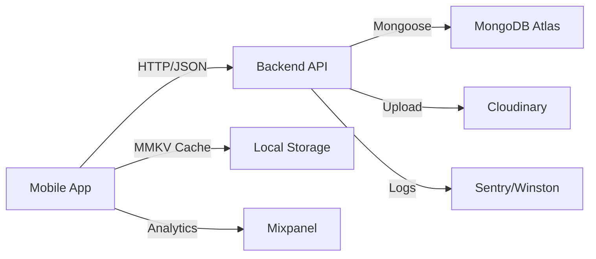

# RIZE - Calisthenics Tracking App

> **Context Engineering Document**: Este README sirve como "cerebro maestro" del proyecto. Cualquier desarrollador o IA puede leer este documento y entender completamente la arquitectura, decisiones técnicas y flujos de trabajo del proyecto.

## 📋 Índice

- [Visión del Proyecto](#visión-del-proyecto)
- [Stack Tecnológico](#stack-tecnológico)
- [Arquitectura](#arquitectura)
- [Estructura del Proyecto](#estructura-del-proyecto)
- [Documentación Técnica](#documentación-técnica)
- [Quick Start](#quick-start)
- [Flujo de Trabajo](#flujo-de-trabajo)

---

## 🎯 Visión del Proyecto

**RIZE** es una aplicación móvil profesional de seguimiento de calistenia que permite a los usuarios:

- **Registrar workouts** con ejercicios predefinidos o personalizados
- **Ganar XP y subir de nivel** automáticamente basado en volumen y variedad de entrenamiento
- **Seguir progresiones** desde variantes básicas hasta avanzadas (Dead Hang → Weighted Pull-ups)
- **Compartir socialmente** con sistema de followers, likes y comentarios
- **Ver estadísticas** detalladas de rendimiento con gráficas y heat maps
- **Desbloquear achievements** por consistencia, volumen y habilidades especiales

### Modelo de Negocio

- **MVP 100% GRATUITO** (sin ads, sin paywall)
- **Futuro Premium**: $0.99/mes con 1 mes de prueba gratis
- **Infraestructura Zero-Cost**: Render.com, MongoDB Atlas M0, Cloudinary free tier

### Filosofía de Producto

- **Mobile-first**: Experiencia optimizada para uso en el gimnasio
- **Offline-first**: Funciona sin internet, sincroniza cuando hay conexión
- **Privacy-first**: No vendemos datos, GDPR compliant desde día 1
- **Gamification sutil**: XP y niveles motivacionales, no intrusivos

---

## 🛠️ Stack Tecnológico

### Backend

| Tecnología | Versión | Propósito |
|------------|---------|-----------|
| **Node.js** | 18+ LTS | Runtime JavaScript |
| **Express** | 4.x | Framework web minimalista |
| **MongoDB** | 6+ | Base de datos NoSQL |
| **Mongoose** | 7.x | ODM para MongoDB |
| **JWT** | jsonwebtoken 9.x | Autenticación stateless |
| **bcrypt** | 5.x | Hash de passwords |
| **Cloudinary** | SDK 1.x | Almacenamiento de imágenes |
| **Winston** | 3.x | Logging estructurado |

**Hosting**: Render.com free tier (512MB RAM, sleep después de 15min inactividad)

### Mobile

| Tecnología | Versión | Propósito |
|------------|---------|-----------|
| **React Native** | 0.73+ | Framework mobile |
| **Expo** | SDK 50+ | Tooling y desarrollo |
| **Expo Router** | v3 | Navegación file-based |
| **NativeWind** | v4 | Tailwind para React Native |
| **MMKV** | 2.x | Storage local rápido |
| **React Query** | 5.x | Data fetching y cache |
| **Zustand** | 4.x | Estado global ligero |

**Build**: EAS Build (Expo Application Services)

### Monitoreo y Analytics

- **Sentry** (free 5K events/mes): Error tracking
- **Mixpanel** (free 20M events/mes): Product analytics
- **Mapbox** (free 50K loads/mes): Geolocalización (futuro)

---

## 🏗️ Arquitectura

### Patrón Arquitectónico: Feature-Based Modular Monolith

```
backend/
├── src/
│   ├── features/           # Módulos por dominio
│   │   ├── auth/
│   │   │   ├── auth.controller.ts
│   │   │   ├── auth.service.ts
│   │   │   ├── auth.routes.ts
│   │   │   └── auth.validation.ts
│   │   ├── workouts/
│   │   ├── exercises/
│   │   ├── social/
│   │   └── achievements/
│   ├── models/             # Mongoose schemas
│   ├── middleware/         # Express middlewares
│   ├── utils/              # Helpers reutilizables
│   ├── config/             # Configuración
│   └── server.ts           # Entry point

mobile/
├── src/
│   ├── app/                # Expo Router (file-based routing)
│   │   ├── (auth)/
│   │   │   ├── login.tsx
│   │   │   └── register.tsx
│   │   ├── (tabs)/
│   │   │   ├── index.tsx        # Home
│   │   │   ├── stats.tsx
│   │   │   ├── social.tsx
│   │   │   └── profile.tsx
│   │   └── _layout.tsx
│   ├── components/         # React components
│   │   ├── ui/            # Design system components
│   │   └── features/      # Feature-specific components
│   ├── hooks/             # Custom hooks
│   ├── services/          # API clients
│   ├── stores/            # Zustand stores
│   └── lib/               # Utilities
```

### Flujo de Datos



### Autenticación

- **JWT Access Token**: 15 minutos, enviado en header `Authorization: Bearer <token>`
- **Refresh Token**: 7 días, almacenado en MongoDB Session collection
- **Flow**: Login → recibe access + refresh → refresca access antes de expirar → si refresh expira, re-login

### Sincronización Offline

1. Usuario crea workout sin internet → guardado en MMKV con flag `pending_sync`
2. App detecta conexión → envía cola de pendientes con `axios-retry`
3. Backend responde con IDs permanentes → app reemplaza IDs temporales
4. Conflictos (edición concurrente): **Last-write-wins** con timestamp `lastEditedAt`

---

## 📁 Estructura del Proyecto

```
calisthenics-app/
├── backend/                 # API Node.js + Express
│   ├── src/
│   ├── tests/
│   ├── package.json
│   ├── tsconfig.json
│   └── .env.example
│
├── mobile/                  # App React Native + Expo
│   ├── src/
│   ├── assets/
│   ├── __tests__/
│   ├── app.json
│   ├── package.json
│   └── tsconfig.json
│
├── docs/                    # Documentación extendida
│   ├── flujo-trabajo/
│   │   ├── git-workflow.md
│   │   ├── definition-of-done.md
│   │   └── tdd-protocol.md
│   ├── arquitectura/
│   │   └── decision-records/
│   └── templates/
│       └── feature-spec-template.md
│
├── README.md               # Este archivo
├── BACKEND_STANDARDS.md    # Estándares de backend
├── FRONTEND_STANDARDS.md   # Estándares de frontend
├── TESTING_STANDARDS.md    # Estrategia de testing
├── DATA_MODEL.md           # Modelos de datos con Mermaid
└── DESIGN_SYSTEM.md        # Sistema de diseño UI/UX
```

---

## 📚 Documentación Técnica

### Documentos Core (LEER PRIMERO)

1. **[BACKEND_STANDARDS.md](./BACKEND_STANDARDS.md)**: Patrones de API, estructura de controllers/services, manejo de errores, validaciones, naming conventions, seguridad.

2. **[FRONTEND_STANDARDS.md](./FRONTEND_STANDARDS.md)**: Arquitectura de componentes, navegación con Expo Router, manejo de estado (Zustand + React Query), styling con NativeWind, animaciones.

3. **[TESTING_STANDARDS.md](./TESTING_STANDARDS.md)**: Protocolo TDD, estructura de tests, cobertura mínima (>90%), mocking, CI/CD.

4. **[DATA_MODEL.md](./DATA_MODEL.md)**: Schemas de MongoDB con Mongoose, relaciones entre entidades, índices, validaciones.

5. **[DESIGN_SYSTEM.md](./DESIGN_SYSTEM.md)**: Colores, tipografía, espaciado, componentes UI, animaciones, patrones de interacción.

### Workflows

- **[Git Workflow](./docs/flujo-trabajo/git-workflow.md)**: Branching strategy, worktrees, commits convencionales.
- **[Definition of Done](./docs/flujo-trabajo/definition-of-done.md)**: Checklist para considerar una tarea completa.
- **[TDD Protocol](./docs/flujo-trabajo/tdd-protocol.md)**: Metodología Red-Green-Refactor obligatoria.

---

## 🚀 Quick Start

### Prerrequisitos

- Node.js 18+
- npm o yarn
- MongoDB Atlas cuenta (free tier)
- Cloudinary cuenta (free tier)
- Expo CLI: `npm install -g expo-cli`

### Backend Setup

```bash
cd backend
npm install
cp .env.example .env
# Editar .env con tus credenciales (MongoDB URI, JWT secret, Cloudinary)
npm run dev
```

Opcional: cargar ejercicios predefinidos (una vez): `npm run seed`

El servidor estará en `http://localhost:5000`

### Mobile Setup

```bash
cd mobile
npm install
npx expo start
```

Escanea el QR con Expo Go (iOS/Android) o presiona:
- `a` para Android emulator
- `i` para iOS simulator

### Variables de Entorno Requeridas

**Backend** (`.env`):
```env
PORT=5000
NODE_ENV=development
MONGODB_URI=mongodb+srv://...
JWT_SECRET=tu-secret-de-32-chars-minimo
JWT_REFRESH_SECRET=otro-secret-diferente
CLOUDINARY_CLOUD_NAME=tu-cloud
CLOUDINARY_API_KEY=tu-key
CLOUDINARY_API_SECRET=tu-secret
```

**Mobile** (`.env`):
```env
EXPO_PUBLIC_API_URL=http://localhost:5000/api
EXPO_PUBLIC_ENV=development
```

---

## 🔄 Flujo de Trabajo

### Regla de Oro

**TODO deliverable DEBE incluir**:
1. ✅ **Código funcional** (siguiendo standards)
2. ✅ **Tests con >90% coverage**
3. ✅ **Docs actualizadas** (si cambió arquitectura)

### Workflow de Desarrollo

1. **Crear feature branch** desde `develop`:
   ```bash
   git checkout -b feature/workout-creation
   ```

2. **Escribir test primero** (TDD):
   ```bash
   npm test -- --watch workout.test.ts
   ```

3. **Implementar feature** hasta que tests pasen

4. **Commit convencional**:
   ```bash
   git commit -m "feat(workouts): add workout creation endpoint"
   ```

5. **Push y abrir PR** con template:
   - Descripción del cambio
   - Tests añadidos
   - Screenshots (si UI)
   - Checklist de Definition of Done

6. **Code review** (mínimo 1 aprobación)

7. **Merge a develop** → deploy automático a staging

8. **Release a main** → deploy a producción

### Commits Convencionales

- `feat`: Nueva funcionalidad
- `fix`: Bug fix
- `docs`: Solo documentación
- `style`: Formato, no lógica
- `refactor`: Refactorización sin cambio de comportamiento
- `test`: Añadir tests
- `chore`: Tareas de mantenimiento

---

## 🎨 Filosofía de Diseño

### Branding

- **Nombre**: RIZE (levántate, sube de nivel)
- **Color primario**: `#10B981` (Emerald 500)
- **Tipografía**: Barlow (headings) + Inter (body)
- **Iconos**: Ionicons exclusively

### Principios UX

1. **Speed**: Registrar workout en <60 segundos
2. **Clarity**: Sin jerga técnica, interfaz auto-explicativa
3. **Delight**: Micro-animaciones sutiles, feedback inmediato
4. **Accessibility**: Contraste WCAG AA, soporte para lectores de pantalla
5. **Offline-first**: Nunca bloquear por falta de internet

### Animaciones

- **Duración base**: 300ms (rápido pero perceptible)
- **Easing**: `easeOutCubic` para salidas, `easeInOutCubic` para movimientos
- **Spring animations**: Para interacciones orgánicas (botones, modals)
- **60fps obligatorio**: Usar `useNativeDriver: true` siempre que sea posible

---

## 📊 Métricas de Éxito

### Técnicas

- **API Uptime**: >99.5%
- **Response time p95**: <500ms
- **Error rate**: <1%
- **Test coverage**: >90%
- **Bundle size mobile**: <25MB

### Producto

- **Time to first workout**: <5 minutos desde descarga
- **DAU/MAU ratio**: >20% (sticky product)
- **Retention D7**: >40%
- **NPS**: >50

---

## 🔐 Seguridad

### Implementado

- ✅ Passwords hasheados con bcrypt (cost 10)
- ✅ JWT con expiración corta (15min access, 7d refresh)
- ✅ Rate limiting (100 req/min global, 5 req/min auth)
- ✅ Input sanitization (express-mongo-sanitize)
- ✅ CORS configurado (no wildcard en prod)
- ✅ Helmet.js para headers de seguridad
- ✅ HTTPS only en producción

### Pendiente v1.1

- 🔄 2FA opcional (TOTP)
- 🔄 Biometric auth (Face ID/TouchID)
- 🔄 Session management avanzado (múltiples dispositivos)

---

## 📞 Soporte y Contribución

### Reportar Bugs

Usar GitHub Issues con template `.github/ISSUE_TEMPLATE/bug.md`

### Solicitar Features

Usar GitHub Issues con template `.github/ISSUE_TEMPLATE/feature.md`

### Pull Requests

Leer [CONTRIBUTING.md](./CONTRIBUTING.md) antes de abrir PR

---

## 📄 Licencia

MIT License - ver [LICENSE](./LICENSE)

---

## 👥 Equipo

- **Product Owner**: [TBD]
- **Tech Lead**: [TBD]
- **Backend Dev**: [TBD]
- **Mobile Dev**: [TBD]

---

## 🗺️ Roadmap

### v1.0 MVP (Q1 2026) ✅ Current

- ✅ Autenticación (email/password)
- ✅ CRUD workouts con ejercicios predefinidos
- ✅ Sistema de XP y niveles
- ✅ Feed social con followers
- ✅ Estadísticas básicas
- ✅ Achievements core

### v1.1 (Q2 2026)

- 🔄 Biometric authentication
- 🔄 Dark mode
- 🔄 Ejercicios custom con fotos
- 🔄 Progresiones visuales
- 🔄 Heat map calendario

### v1.2 (Q3 2026)

- 🔄 Notificaciones push
- 🔄 Rutinas predefinidas
- 🔄 Export data (PDF/CSV)
- 🔄 Premium tier ($0.99/mes)

### v2.0 (Q4 2026)

- 🔄 AI coach (sugerencias de entrenamiento)
- 🔄 Challenges comunitarios
- 🔄 Video form checks (ML)
- 🔄 Integraciones (Apple Health, Google Fit)

---

**Última actualización**: Enero 23, 2026
**Versión del documento**: 1.0.0
